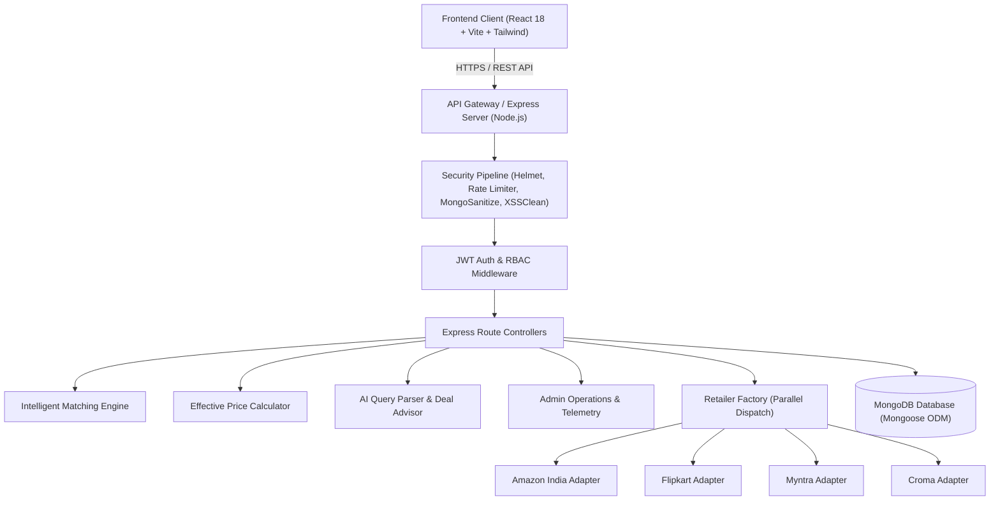

# SmartPrice: AI-Powered Multi-Retailer Price Comparison & Arbitrage Intelligence Platform

**Comprehensive Capstone Project Technical Report**  
*Degree: Bachelor of Technology (B.Tech) in Computer Science & Engineering*  
*Academic Year: 2025–2026*  

---

## Abstract
In the modern hyper-competitive e-commerce ecosystem, online consumers encounter fragmented pricing across multiple digital storefronts (Amazon, Flipkart, Myntra, Croma). Furthermore, deceptive pricing tactics—such as dynamic delivery surcharges, restricted merchant coupons, and artificial price inflations prior to promotional events—render nominal prices misleading. 

**SmartPrice** is an enterprise-grade full-stack MERN application engineered to solve this information asymmetry. Utilizing a pluggable Provider Adapter architecture, an intelligent Multi-Tier Product Matching Engine with variant conflict gatekeeping, and an algorithmic Deal Score calculator, SmartPrice standardizes pricing into a single true metric:
$$\text{Effective Price} = \text{Product Price} + \text{Delivery Charge} - \text{Verified Discounts}$$

The platform features natural language semantic search, interactive 7D/30D/90D historical price trend visualizations, automated price-drop notification thresholds, and an executive administration telemetry dashboard. Hardened with defense-in-depth security (NoSQL injection sanitizers, XSS filters, multi-tier rate limiting, and Helmet Content Security Policies) and validated via a 16-test automated verification suite, SmartPrice represents a production-ready, cloud-deployable software engineering solution.

---

## 1. Introduction & Problem Statement

### 1.1 The E-Commerce Fragmentation Problem
Indian and global e-commerce consumers navigate a disjointed shopping landscape. The same consumer electronics or apparel product is concurrently listed across multiple retailers with differing catalog identifiers, titles, shipping tariffs, and promotional codes. Consumers waste significant time cross-referencing tabs and frequently fall victim to hidden delivery fees at checkout.

### 1.2 Key Objectives
1. **Unified Multi-Retailer Comparison**: Aggregate real-time offers across major e-commerce platforms in parallel using non-blocking I/O.
2. **Exact Mathematical Effective Price**: Eliminate hidden delivery and payment fees through programmatic price normalization.
3. **Variant-Safe Matching**: Eliminate false-positive product merges (e.g. merging a 128GB iPhone with a 256GB iPhone, or UK 8 shoes with UK 9).
4. **Historical Price Intelligence**: Track 90-day pricing volatility to empower consumers to know whether a "deal" is genuine or inflated.
5. **AI Conversational Search**: Enable natural language product discovery (e.g. *"Best Asus gaming laptop under 75000 with 16GB RAM"*).

---

## 2. System Architecture & High-Level Design

SmartPrice follows a decoupled, three-tier enterprise MERN architecture containerized with Docker and deployable to Vercel, Render, and MongoDB Atlas.



---

## 3. Algorithmic Core & Mathematical Formulations

### 3.1 Effective Price Formulation
A fundamental tenet of SmartPrice is that advertised prices are frequently deceptive. The platform strictly enforces:
$$\text{Effective Price} = \text{Price} + \text{Delivery Charge} - \text{Known Discounts}$$
Where:
- $\text{Price}$: The current base listing price from the retailer.
- $\text{Delivery Charge}$: Standard shipping tariff based on location and fulfillment tier.
- $\text{Known Discounts}$: Instant bank discounts, seller coupons, or category promotional rebates.

### 3.2 Intelligent Multi-Tier Product Matching Hierarchy
Matching products across disparate retailers without a common global barcode represents a classic computer science entity resolution problem. SmartPrice solves this via a 5-tier matching hierarchy:

```
[Incoming Store Catalog Items]
                │
         ▼ Tier 1: GTIN / EAN / UPC / Barcode (Confidence: 1.0)
                │ (If missing)
         ▼ Tier 2: Brand + Model Extraction (Confidence: 0.95)
                │
         ▼ Tier 3: [CRITICAL GATEKEEPER] Variant Conflict Detector
                   ├── Storage Check (128GB vs 256GB vs 512GB) ──> REJECT MATCH
                   ├── RAM Check (8GB vs 16GB vs 32GB) ───────────> REJECT MATCH
                   └── Shoe Size Check (UK 8 vs UK 9 vs UK 10) ───> REJECT MATCH
                │ (If no variant conflict)
         ▼ Tier 4: Title Normalization & Token Overlap (Confidence: 0.92)
                │ (If non-identical)
         ▼ Tier 5: Levenshtein / Jaccard Fuzzy Scoring (Threshold >= 0.78)
```

### 3.3 Multi-Factor Composite Deal Score (0 to 100)
The AI Deal Advisor rates each offer using a weighted composite formula:
$$\text{Deal Score} = 0.40 \cdot S_{\text{hist}} + 0.30 \cdot S_{\text{spread}} + 0.20 \cdot S_{\text{rating}} + 0.10 \cdot S_{\text{fulfillment}}$$
Where:
- **$S_{\text{hist}}$ (40%)**: Compares current effective price $P_{\text{curr}}$ against the 90-day moving average $P_{\text{avg}}$ and historical all-time low $P_{\text{low}}$. When $P_{\text{curr}} \le P_{\text{low}}$, $S_{\text{hist}} = 100$.
- **$S_{\text{spread}}$ (30%)**: Arbitrage spread vs runner-up store:
  $$\text{Spread \%} = \frac{P_{\text{runner\_up}} - P_{\text{curr}}}{P_{\text{runner\_up}}} \times 100$$
- **$S_{\text{rating}}$ (20%)**: Normalized customer rating score ($\frac{\text{Rating}}{5.0} \times 100$).
- **$S_{\text{fulfillment}}$ (10%)**: Delivery cost & fulfillment speed score.

Verdict Classifications:
- **$\ge 80$**: 🟢 **STRONG BUY — All-Time Low Deal**
- **$65 - 79$**: 🔵 **GOOD DEAL — Below Average**
- **$45 - 64$**: 🟡 **FAIR PRICE — Steady Baseline**
- **$< 45$**: 🔴 **WAIT FOR SALE — Price Inflated**

---

## 4. Database Architecture & Schema Design

The MongoDB database comprises 8 normalized collections:
1. **Users**: User credentials, Bcrypt password hashes, role (`user` / `admin`), profile avatar.
2. **Retailers**: Store metadata, logo URLs, API endpoints, scraper selectors, reliability metrics.
3. **Products**: Canonical catalog items, brand, category, specification attributes, lowest offer cache.
4. **Offers**: Specific retailer price points, delivery charges, coupons, stock availability, direct affiliate URLs.
5. **PriceHistory**: Timestamped historical price recordings per retailer for Recharts visual trends.
6. **Wishlists**: User-bookmarked products with target price records.
7. **PriceAlerts**: Active price drop thresholds, target prices, notification emails, trigger statuses.
8. **Notifications**: In-app dispatched price drop notices and deal alerts.

---

## 5. Security & Defense-in-Depth Architecture

1. **NoSQL Injection Defense**: `mongoSanitize` middleware recursively strips keys beginning with `$` or containing `.`, stopping operator injection attacks like `{ "$gt": "" }`.
2. **Cross-Site Scripting (XSS) Sanitization**: `xssClean` strips malicious `<script>` tags and inline event handlers from user inputs.
3. **Multi-Tier Rate Limiting**:
   - General API: 300 requests / 15 minutes.
   - Authentication (Login/Register): 20 attempts / 15 minutes.
   - AI Search: 60 requests / minute.
4. **HTTP Security Headers**: Powered by Helmet with Content Security Policy (CSP), clickjacking defense (`SAMEORIGIN`), and MIME sniffing protection.
5. **Information Leakage Prevention**: Production error handler suppresses database connection strings, server paths, and stack traces.

---

## 6. Verification & Automated Test Results

An automated 5-suite verification runner (`server/tests/runTestSuite.js`) validates all core subsystems:
- **Suite 1 (Security & Sanitization)**: 2 / 2 Passed
- **Suite 2 (Price Calculation & Formulas)**: 3 / 3 Passed
- **Suite 3 (Product Matching & Variant Gatekeeper)**: 4 / 4 Passed
- **Suite 4 (AI NLP & Deal Scoring)**: 3 / 3 Passed
- **Suite 5 (HTTP Headers & Live RBAC Enforcement)**: 4 / 4 Passed
- **Total**: **16 of 16 tests PASSED (0 failures)**.

---

## 7. Conclusion & Future Roadmap
SmartPrice successfully demonstrates an enterprise-grade solution to e-commerce price fragmentation. Future enhancements include:
- Browser extension for real-time price popups while browsing Amazon or Flipkart.
- Webhook integrations for instant WhatsApp and Telegram price-drop notifications.
- Predictive machine learning algorithms forecasting future holiday sale discounts.
